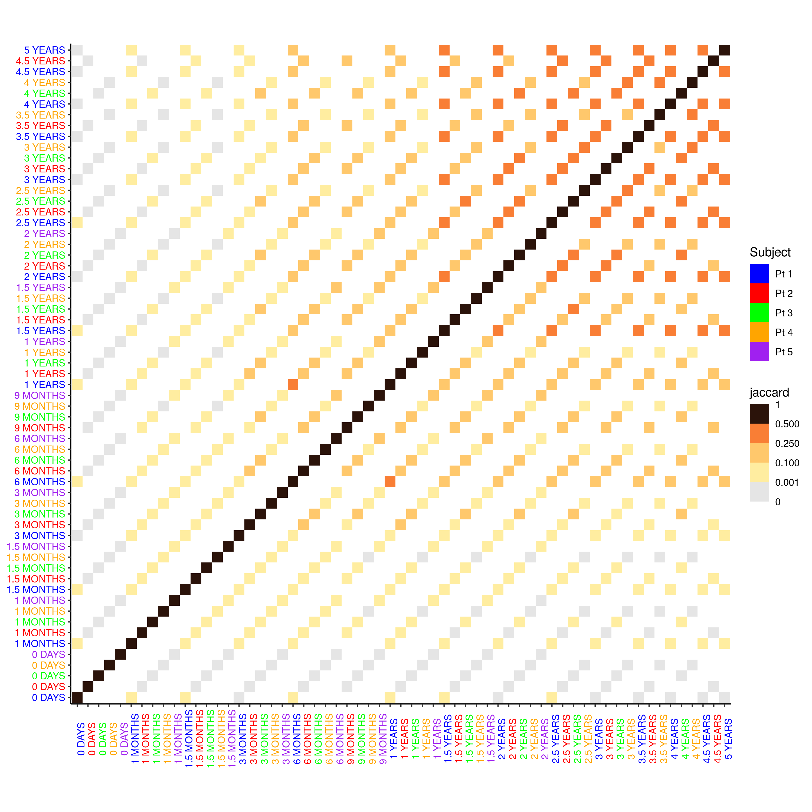

<style>
.main-container {
  max-width: 1500px;!important
  margin-left: auto;!important
  margin-right: auto;!important
}
body{
  font: normal 20px Verdana, Arial, sans-serif;
}
.hljs {
    font-size: 15px;
}
</style>

# figure to reproduce

We have insertion site analysis samples of several time points for five subjects. The number of samples per subject varies.
We would expect some number of insertion sites to be shared between different time points on the same subject. The similarity
between two sets can be neasured using the Jaccard index

$$
jaccard(A,B)=\frac{\left | A\bigcap B \right |}{\left | A \bigcup B \right |} =
\frac{\left | A\bigcap B \right |}{\left | A \right | + \left | B \right | - \left | A \bigcap B \right |}
$$
```{r, fig.width=5}

```
# Code

## loading data
```{r}
library(tidyverse)
tabs <- readRDS('heatmap_data.rds')
tabs
```

## computing Jaccard and pivoting

```{r}
long_tables <- imap(tabs,function(tab,name){
  factor_order <- c("0 DAYS","1 MONTHS","1.5 MONTHS","3 MONTHS","6 MONTHS","9 MONTHS",
                    "1 YEARS","1.5 YEARS","2 YEARS","2.5 YEARS","3 YEARS",
                    "3.5 YEARS","4 YEARS","4.5 YEARS","5 YEARS","6 YEARS")
  as.data.frame(tab$table) %>%
    rownames_to_column(var = "y") %>% 
    #  mutate(across(where(is.numeric),~./max(.))) %>%
    pivot_longer(!y,values_to='val', names_to='x') %>%
    mutate(x=fct_relevel(x,factor_order[factor_order %in% x])) %>%
    mutate(y=fct_relevel(as.factor(y),factor_order[factor_order %in% y])) %>%
    mutate(y_count=tab$counts[as.character(y)],x_count=tab$counts[as.character(x)]) %>%
    mutate(jaccard=(val/(x_count+y_count-val))) %>%
    mutate(sample_name=name) %>%
    mutate(x_s=paste(x,sample_name),y_s=paste(y,sample_name))
})
head(long_tables,n=2)
```

## Orderding factors and labels

```{r}
factor_order <- c("0 DAYS","1 MONTHS","1.5 MONTHS","3 MONTHS","6 MONTHS","9 MONTHS",
                  "1 YEARS","1.5 YEARS","2 YEARS","2.5 YEARS","3 YEARS",
                  "3.5 YEARS","4 YEARS","4.5 YEARS","5 YEARS","6 YEARS")
long_names <- names(long_tables)
SS <- levels(as.factor(reduce(long_tables,rbind)$x_s))
is_valid <- function(x,y,ss) paste(x,y) %in% ss
valid_paste <- function(x,y,ss) ifelse(is_valid(x,y,ss),paste(x,y),'Na')
inv_valid_paste <- function(x,y,ss) ifelse(is_valid(y,x,ss),paste(y,x),'Na')
get_first_valid <- function(x,y,ss) ifelse(is_valid(y,x,ss),x,'Na')
get_second_valid <- function(x,y,ss) ifelse(is_valid(y,x,ss),y,'Na')
SS
```

```{r}
#factor_order_plus_tmp <- as.vector(outer(factor_order, long_names, FUN =valid_paste,ss=SS))
#factor_order_plus <- factor_order_plus_tmp[factor_order_plus_tmp != 'Na']
factor_order_per_date_tmp <- as.vector(outer(long_names,factor_order, FUN = inv_valid_paste, ss=SS))
factor_order_per_date <- factor_order_per_date_tmp[factor_order_per_date_tmp != 'Na']
factor_order_per_date
```

```{r}
get_first_valid <- function(x,y,ss) ifelse(is_valid(y,x,ss),x,'Na')
get_second_valid <- function(x,y,ss) ifelse(is_valid(y,x,ss),y,'Na')

date_order_per_date_tmp <- as.vector(outer(long_names,factor_order, FUN = get_second_valid,ss=SS))
date_order_per_date <- date_order_per_date_tmp[date_order_per_date_tmp != 'Na']
names_order_per_date_tmp <- as.vector(outer(long_names,factor_order, FUN = get_first_valid,ss=SS))
names_order_per_date <- names_order_per_date_tmp[names_order_per_date_tmp != 'Na']
date_order_per_date
names_order_per_date
```

## plotting

```{r , fig.width=12}
div_text_color <- c('blue','red','green','orange','purple')
per_date_sample_color <- sapply(as.integer(as.factor(names_order_per_date)),function(x) {return(div_text_color[x])} )
sample_to_color_df <- data.frame(sample=names(long_tables),color=div_text_color)

pp <- reduce(long_tables,rbind) %>% 
  mutate(x_s=fct_relevel(x_s,factor_order_per_date)) %>%
  mutate(y_s=fct_relevel(y_s,factor_order_per_date)) %>%
  ggplot( aes(x_s,y_s, fill= jaccard,color=sample_name)) + 
  geom_tile(size=0)
pp
```

```{r , fig.width=12}
pp2 <- pp +
  theme_classic() +
    theme(axis.text.x = element_text(angle = 90,color = per_date_sample_color),
        axis.text.y = element_text(color = per_date_sample_color),
        axis.title.x=element_blank(),
        axis.title.y=element_blank()) +
  coord_equal()
pp2
```

```{r , fig.width=12}
pp3 <- pp2 + 
    scale_x_discrete(labels=date_order_per_date) +
    scale_y_discrete(labels=date_order_per_date) 
pp3
```


```{r , fig.width=12}
pp4 <- pp3 +   scale_fill_stepsn(breaks = c(0.001,0.1, 0.25, 0.5),colors=c('#ffeda0','#feb24c','#f03b20','#000000'),values = c(0.05,0.25,0.5,0.8),show.limits = TRUE,na.value="grey90") 
  
pp4
```


```{r, fig.width=12}
pp5 <- pp4 +
guides(colour=guide_legend("Subject", override.aes=list(size=0, fill=sample_to_color_df$color)))
pp5
```

# Subject ordered

The same procedure can produce a figure ordered by subject
```{r, fig.width=12}
knitr::include_graphics("per_subject_jaccard.png")
```

# Issues

* Vectorized input to "element_text()" is not officially supported.
* This is essentially overriding the labels manually. It is prone to error that are
hard to detect
* The labels/color should be store in the same object as the data
* Too much code!!!