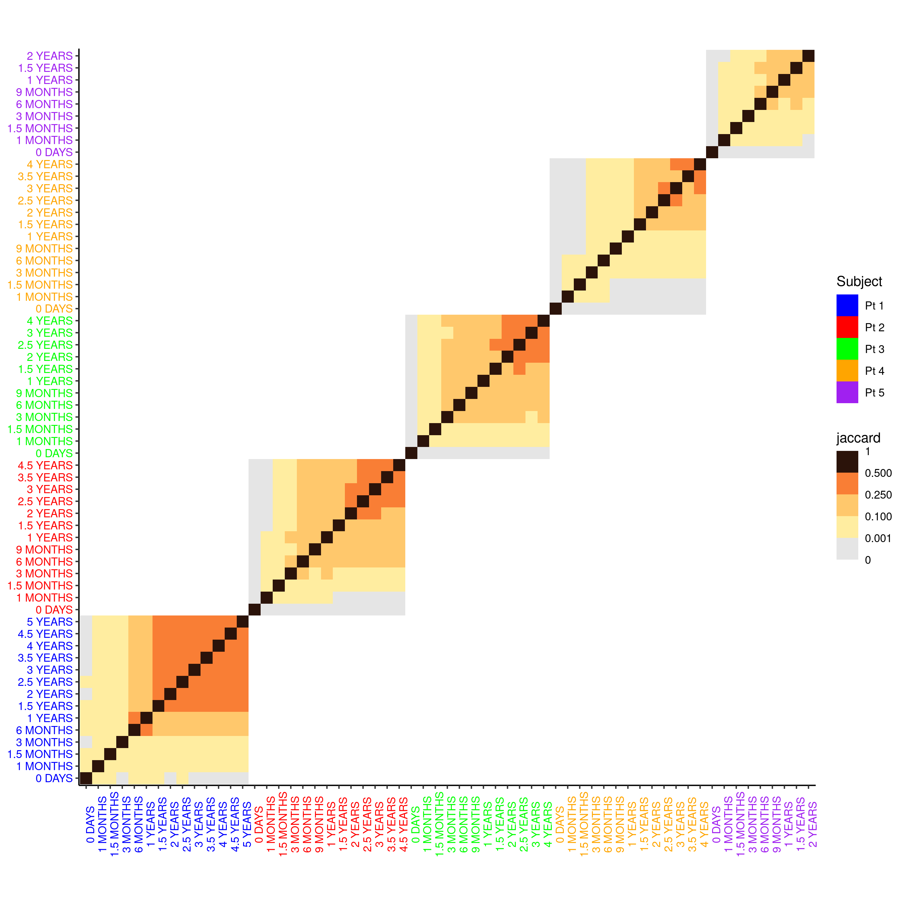
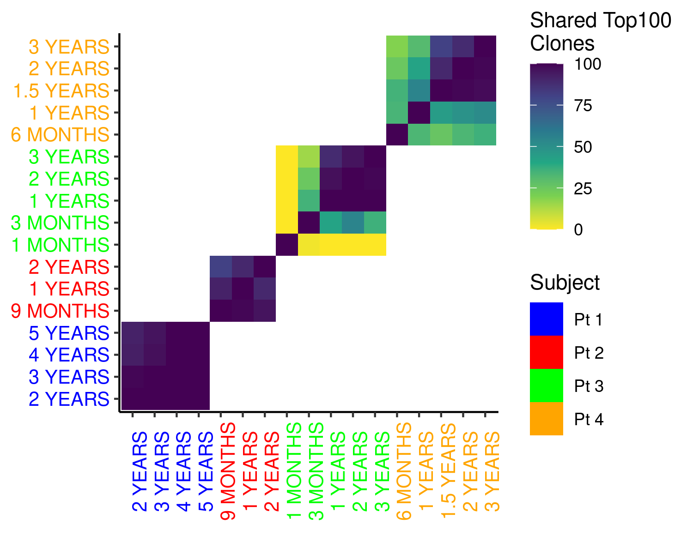
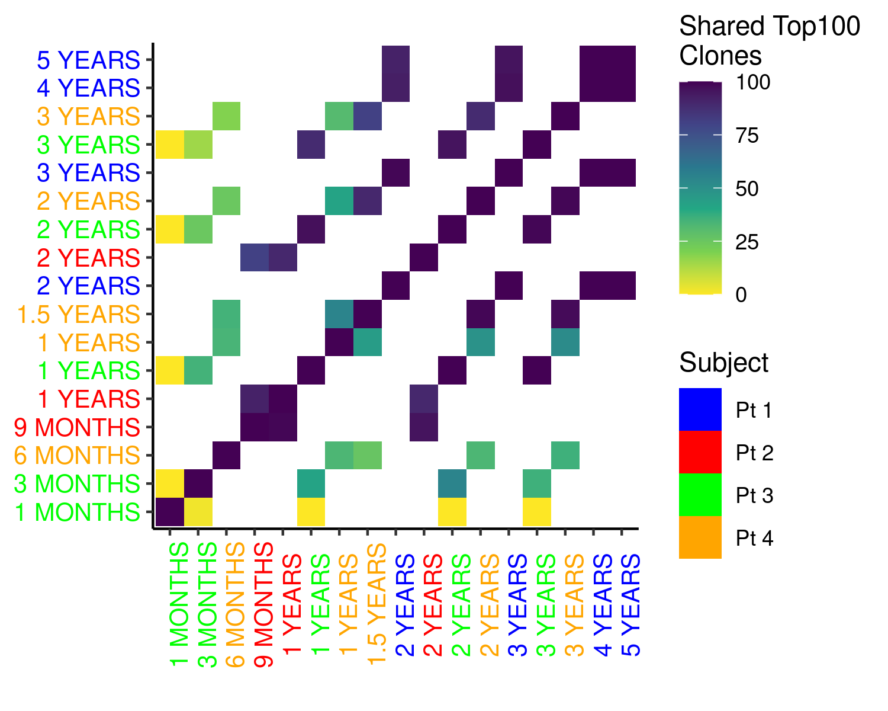

```{r setup, include=FALSE}
knitr::opts_chunk$set(echo = TRUE)
knitr::opts_chunk$set(fig.pos = 'H')
suppressMessages(library("tidyverse"))
#library(tidyverse)
library(kableExtra)
```

## Samples

Samples of different blood cells from patients with Wiskott-Aldrich syndrome where essayed for insertion site at different time point after gene therapy treatment.


```{r sample_table_t0, echo=FALSE}
pWAS.list <- readRDS('pWAS.list.rds')

pwas.time <- function(x){
  dot.for.dash <- function(x) sub("[-_]",".",x)
  d.nought <- function(x) sub("d0.*","D0",x,ignore.case=TRUE)
  d42.to.wk6 <- function(x) sub("^d4[25]$","wk6",x)
  pwas.unit <- function(x) c(WK = "WEEKS", M="MONTHS", Y="YEARS", D="DAYS")[
    sub("[[:digit:]].*$","",x)]
  pwas.timeval <- function(x) sub("[[:alpha:]]+","",x)
  x <- as.character(x)
  tm <- toupper( d42.to.wk6( d.nought( dot.for.dash( x ))))
  res <- paste(pwas.timeval( tm ), pwas.unit( tm ))
  res[ res == "18 MONTHS" ]  <- "1.5 YEARS"
  res[ res == "30 MONTHS" ]  <- "2.5 YEARS"
  res[ res == "42 MONTHS" ]  <- "3.5 YEARS"
  res[ res == "32 DAYS" ]  <- "1 MONTHS"
  res[ res %in% c("45 DAYS", "42 DAYS") ]  <- "1.5 MONTHS"
  res[ res == "6 WEEKS" ]  <- "1.5 MONTHS"
  res
}

tabs <-
  imap(pWAS.list,
         function(pt,x){
           output_list = list()
           time <- pwas.time(pt$d$timePoint)
           table <- table(pt$d$posid,factor(time,unique(time)))>0
           table_sum <- crossprod(table)
           counts <- data.frame(table) %>% summarise_all(~sum(.)) %>% simplify()
           names(counts) <-  colnames(table_sum)
           output_list$table  <- table_sum
           output_list$counts <- counts
           output_list$name <- x
 #          browser()
           return(output_list)
         })

           factor_order <- c("0 DAYS","1 MONTHS","1.5 MONTHS","3 MONTHS","6 MONTHS","9 MONTHS",
                  "1 YEARS","1.5 YEARS","2 YEARS","2.5 YEARS","3 YEARS",
                  "3.5 YEARS","4 YEARS","4.5 YEARS","5 YEARS")
data_samples <-imap(tabs,function(pt,x){
           kk <- factor_order %in% names(pt$counts)
           as.data.frame(t(c(x,kk)))})

all_data_samples<-reduce(data_samples,rbind)
colnames(all_data_samples) <- c("Subject",factor_order)
```


```{r print_tab, results='asis', echo=FALSE}
all_data_samples %>% 
  mutate(across('0 DAYS':'5 YEARS',~ifelse(.x==TRUE,'X',.x))) %>%
  mutate(across('0 DAYS':'5 YEARS',~ifelse(.x==FALSE,'',.x))) %>%
  kable() #%>%
  #kable_styling(latex_options = c("hold_position","scale_down","striped"))
```

## Shared insertion sites and Jaccard distance

Samples from the same subject at different time points can share a subset of insertions sites. The Jaccard distance can be used to quantify this  
$$
jaccard(A,B)=\frac{\left | A\bigcap B \right |}{\left | A \bigcup B \right |}
$$


```{r pdj, echo=FALSE, out.width="100%",fig.align="center" ,fig.cap="Samples arranged per date"}
knitr::include_graphics("per_date_jaccard.png")
```

```{r, echo=FALSE, out.width="100%",fig.align="center" ,fig.cap="Samples arranged per Subject"}

```

## Loss of diversity

As time passes, you would expect to lose some insertion site diversity as those clones fail to grow. A rapid loss of diversity however, might indicate a clone is expanding and some increased risk of cancer exists. The Simpson index ($D$) measures the probability that two randomly selected individual in a population (cell with insertion sites in this case) are of the same species (having the same insertion site). A Sample with high Simpson index is thus, less diverse. It is important to mention that we are using the original formulation, where the observation are taken without replacement. this formulation differs significantly from the more widely used "with replacement" specially in situation where you expect a large number of rare species (as is the case here). 

```{r, echo=FALSE, out.width="100%",fig.align="center" ,fig.cap="Simpson per Cell Type and Subject"}
knitr::include_graphics("cellTypeSimpsonPlot.png")
```

## MCMC posteriori populations

The sampling of insertion sites by sequencing is imperfect; the relative abundance of observed clones are only approximations of the real ones. Worse still, most of the low abundance clones might not have been sampled at all. To address this, a Markov Chain Monte Carlo was developed by Charles Berry. Briefly, a Bayesian hierarchical model is used to update the relative abundance distribution and samples are pulled from the posteriori every 20 steps or so. After doing this for each sequencing sample, the top 100 abundant clones can be identified for each subject/time combination (those clones might or might not correspond to an insertion site that was observed). Some proportion of the clones might be shared between samples of the same subject.

```{r, echo=FALSE, out.width="100%",fig.align="center" ,fig.cap="Posteriori top100 arranged per Subject"}

```

```{r, echo=FALSE, out.width="100%",fig.align="center" ,fig.cap="Posteriori top100 arranged per Date"}

```

## Comments

* Diversity of insertion sites drops with time, this is consistent in all subjects.
* From the Jaccard distances, it seems like the loss of diversity of insertion sites accelerates at around year 2.
* This might correspond to the death of short term progenitor cells
* The MCMC approach suggest that the Jaccard distance is underestimating the proportion of shared insertion sites.

## TODO?
Not sure if I should spend more time doing those

* I was unable to reproduce the tables shared in a power point presentation. Should I contact the author?
* MCMC was only done for a handful of samples. Rick's recollection is that convergence was an issue, but it might be worthy to try it with more samples.
